# 🎬 פרויקט גלריית סרטים (Movie Gallery)

פרויקט Full-Stack המאפשר צפייה, ניהול והוספה של סרטים לגלריה. הפרויקט בנוי בארכיטקטורת שרת-לקוח, וכולל מערכת הרשמה והתחברות למשתמשים, הצגת פרטי סרטים נרחבים, ושימוש בהגנה על נתיבים (Protected Routes) עבור פעולות מורשות.

## 🛠️ טכנולוגיות

**צד לקוח (Frontend):**
* React
* עיצוב מודולרי באמצעות CSS Modules
* ניהול קריאות API נפרד

**צד שרת (Backend):**
* Node.js & Express
* MongoDB (כמסד נתונים להמשכיות המידע)
* מנגנון אימות והרשאות (Guards) 

## 📂 מבנה הפרויקט

הפרויקט מחולק לשתי ספריות עיקריות, כל אחת אחראית על צד אחר באפליקציה:

### צד שרת (`backend/`)
* `config/` - הגדרות תצורה כלליות לשרת.
* `controllers/` - הלוגיקה העסקית של המערכת (לדוגמה: שליפת סרטים, ניהול משתמשים).
* `models/` - הגדרת מבנה הנתונים (Schemas) מול מסד הנתונים.
* `routes/` - הגדרת נתיבי ה-API השונים (`movies.js`, `users.js`).
* `guard/` - פונקציות Middleware לבדיקת הרשאות ואימות משתמשים לפני ביצוע פעולות רגישות.
* `data/` - קבצי נתונים מקומיים במידת הצורך.
* `seed.js` - סקריפט מובנה לאכלוס ראשוני של מסד הנתונים בסרטים ובמשתמשים.
* `requests.http` - קובץ עזר לבדיקת קריאות ה-API מול השרת ישירות מהעורך.

### צד לקוח (`frontend/`)
* `src/api/` - ניהול כל התקשורת מול ה-Backend (`auth.js`, `movies.js`).
* `src/components/` - רכיבי UI רב-פעמיים:
  * `AddMovie/` - טופס להוספת סרט חדש לגלריה.
  * `Navbar/` - סרגל הניווט הראשי.
  * `Button/`, `Input/`, `Error/` - רכיבי בסיס לעיצוב אחיד.
  * `ProtectedRoute/` - רכיב מעטפת שמוודא שהמשתמש מחובר לפני גישה לעמודים חסומים.
* `src/pages/` - העמודים המרכזיים באפליקציה:
  * `AuthPage` - עמוד התחברות / הרשמה.
  * `MoviesPage` - עמוד הבית המציג את גלריית הסרטים.
  * `MovieDetailsPage` - עמוד המציג מידע מורחב על סרט ספציפי.

## 📸 צילומי מסך (Screenshots)

*(כדי להציג את התמונות, יש להוסיף את קבצי התמונות לתיקיית `screenshots` בפרויקט)*

**עמוד התחברות/הרשמה:**

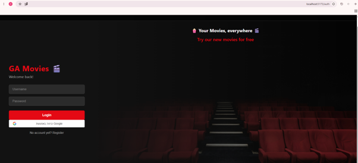

**התחברות באמצעות גוגל:**

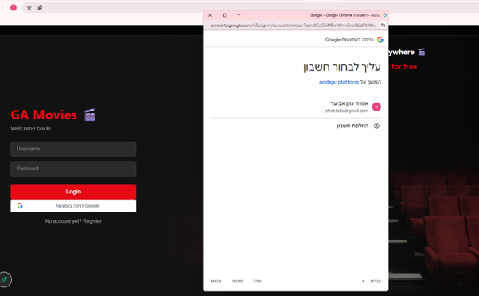

**עמוד הבית (גלריית הסרטים):**

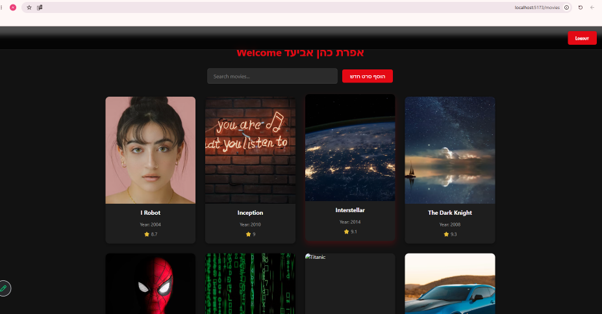

**עמוד פרטי סרט:**

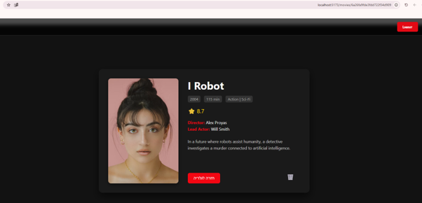

**הוספת סרט**

**טופס הוספת סרט חדש:**

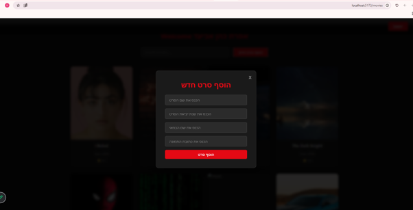

**הוספת סרט ללא שם סרט:**

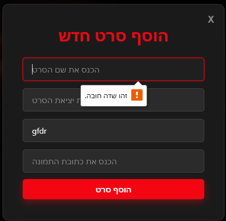

**הוספת סרט ללא שנה:**

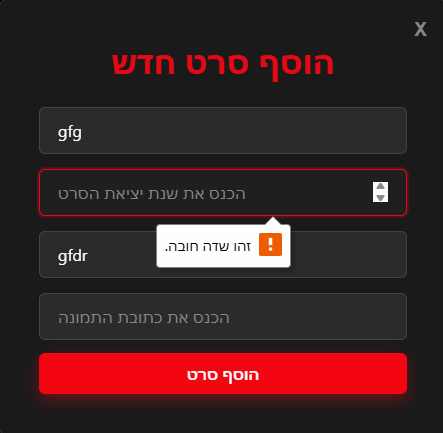

**הוספת סרט עם URL לא תקין:**

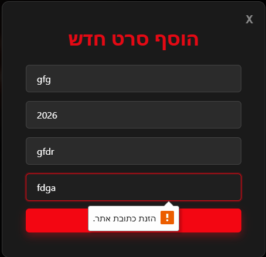

**הוספת סרט עם כל הפרטים:**

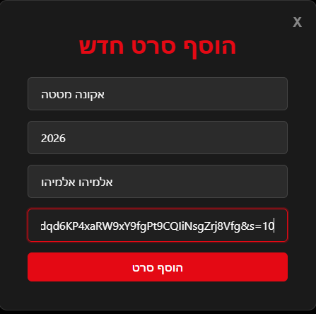

**הסרט נוסף לגלריה:**

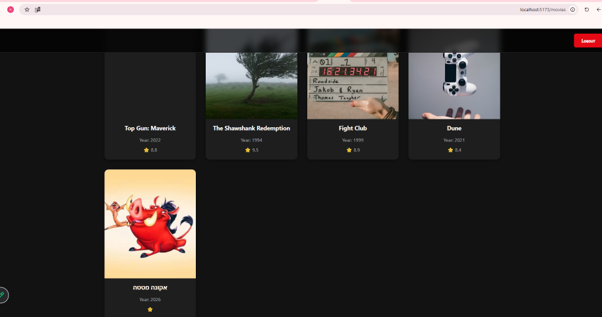

**מחיקת סרט:**

**מחיקת הסרט**

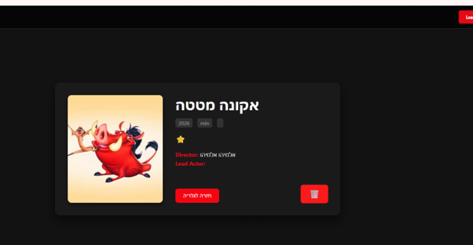

**וידוא מחיקת סרט**

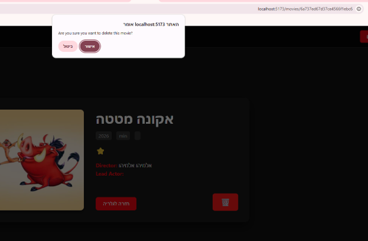

**הסרט נמחק מהגלריה**

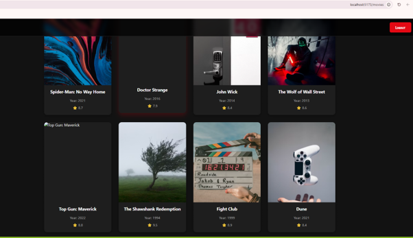

**חיפוש סרט:**

**חיפוש סרט לפי שם**

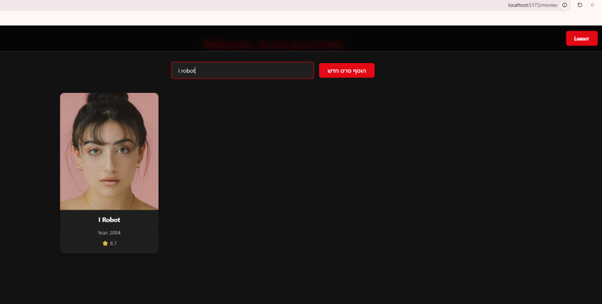

**חיפוש סרט לפי שנה**

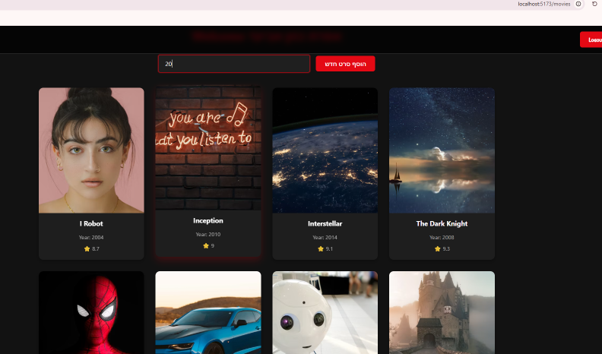

**חיפוש סרט לפי ז'אנר**

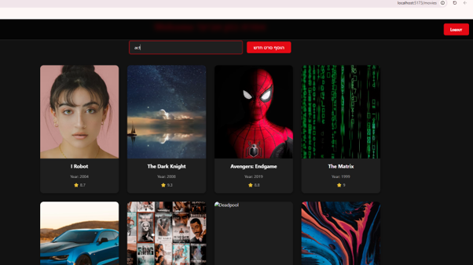

## 🧠 אתגרים במהלך הפיתוח ופתרונם
להלן סיכום של האתגרים המרכזיים שעלו במהלך המשימה וכיצד הם נפתרו:

1. **כפילות בניתוב (Routing):** הגדרת הנתיב `/movies` בראוטר של צד השרת יצרה כפילות ובעיות ניתוב. **הפתרון:** הבנו שאת נתיב ה-`/movies` יש להגדיר בצד הלקוח (Frontend), בעוד שבצד השרת (בראוטר עצמו) מספיק להשתמש בנתיב היחסי `/`.
2. **סינון לפי ז'אנר (מערך):** מאחר ושדה הז'אנר הוא מערך, לא יכולנו להשתמש בחיפוש מחרוזת רגיל. **הפתרון:** שימוש בפונקציית המערך `some()` כדי לעבור על האיברים ולבצע `include` לכל ז'אנר בנפרד.
3. **טיפול בהודעות שגיאה (Invalid ID):** השקענו זמן רב סביב בדיקת מזהה (ID) שגוי, מכיוון שהופיעה הודעת שגיאה לא רצויה. **הפתרון:** שינינו והתאמנו את תוכן הודעת השגיאה בקוד.
4. **יצירת חלון מודאלי (Modal):** הקפצת רכיב כחלון מודאלי צף מעל המסך. **הפתרון:** שילוב של קוד שנכתב בעבר יחד עם חקירה נוספת באינטרנט.
5. **עיצוב ומיקום (CSS):** התאמת הנראות והמיקום הרלטיבי (Relative) של הכפתור. **הפתרון:** עבודה עם כלי המפתחים בדפדפן (Inspect) לתהליך של ניסוי וטעייה.
6. **ניקוי קוד (Console logs):** איתור כל הדפסות ה-console בפרויקט לקראת הגשה. **הפתרון:** נעזרנו בחיפוש הגלובלי (Global Search) של עורך הקוד (VS Code).

## 🚀 התקנה והרצה מקומית

### דרישות מוקדמות
* Node.js מותקן על המחשב.
* חיבור למסד נתונים (MongoDB).

### 1. הפעלת צד השרת (Backend)
1. פתחו את הטרמינל ונווטו לתיקיית השרת: `cd backend`
2. התקינו את התלויות הנדרשות: `npm install`
3. ודאו שקיים קובץ `.env` ובו מוגדרים משתני הסביבה הנדרשים (כגון מחרוזת התחברות ל-DB וסוד לטוקן).
4. (אופציונלי) הריצו את סקריפט האכלוס הראשוני: `node seed.js`
5. הריצו את השרת: `npm start` או בהתאם למוגדר ב-`package.json`.

### 2. הפעלת צד הלקוח (Frontend)
1. פתחו טרמינל חדש ונווטו לתיקיית הלקוח: `cd frontend`
2. התקינו את התלויות הנדרשות: `npm install`
3. (אם נדרש) עדכנו את קובץ ה-`.env` להפניה לכתובת השרת המקומית.
4. הפעילו את סביבת הפיתוח: `npm run dev` (או `npm start`).

---
**פותח על ידי:** אפרת כהן אביעד, חיה יפרח, איתמר גבסי-כהן, ירדן סגרון